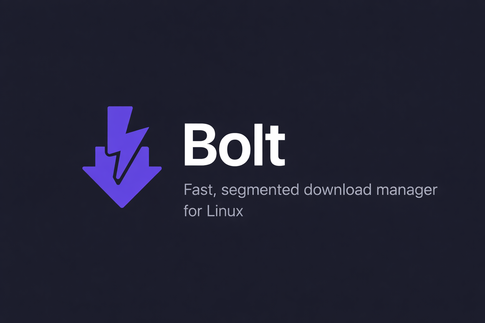

<p align="center">
  
</p>

<p align="center">
  <strong>Fast, segmented download manager daemon for Linux.</strong>
</p>

<p align="center">
  <a href="https://github.com/fhsinchy/bolt/actions/workflows/ci.yml"></a>
  <a href="https://github.com/fhsinchy/bolt/releases/latest"></a>
  <a href="LICENSE"></a>
</p>

## Features

- **Segmented downloading** — splits files into up to 32 concurrent connections (default 16)
- **Pause and resume** — segment progress persists to SQLite, survives process restarts
- **Auto-retry** — per-segment exponential backoff for transient failures
- **Download queue** — configurable max concurrent downloads with FIFO scheduling
- **Speed limiter** — global rate limiting across all active segments
- **Queue reordering** — reprioritize pending downloads
- **Dead link refresh** — URL renewal for expired CDN links
- **Checksum verification** — SHA-256, SHA-512, SHA-1, MD5; verified on completion
- **Desktop notifications** — completion and failure alerts via `notify-send`
- **REST API + WebSocket** — full HTTP API over Unix socket for scripting and integration
- **Systemd integration** — Type=notify service with hardened sandboxing
- **No dependencies** — single static binary, no CGO, no GUI toolkit required

## Install

One-liner:

```bash
curl -fsSL https://raw.githubusercontent.com/fhsinchy/bolt/master/install.sh | sh
```

This downloads the latest release, installs the binary to `~/.local/bin`, sets up a systemd user service, desktop entry, and icon. Bolt starts automatically on login.

To uninstall:

```bash
curl -fsSL https://raw.githubusercontent.com/fhsinchy/bolt/master/install.sh | sh -s -- --uninstall
```

Make sure `~/.local/bin` is in your `PATH`.

### Manual install

Download the latest tarball from [GitHub Releases](https://github.com/fhsinchy/bolt/releases/latest):

```bash
tar xzf bolt-linux-amd64.tar.gz
cd bolt-linux-amd64

mkdir -p ~/.local/bin ~/.config/systemd/user ~/.local/share/applications ~/.local/share/icons/hicolor/256x256/apps
cp bolt ~/.local/bin/
cp bolt.service ~/.config/systemd/user/
sed "s|Exec=bolt|Exec=$HOME/.local/bin/bolt|" bolt.desktop > ~/.local/share/applications/bolt.desktop
cp appicon.png ~/.local/share/icons/hicolor/256x256/apps/bolt.png
gtk-update-icon-cache -f -t ~/.local/share/icons/hicolor 2>/dev/null || true
update-desktop-database ~/.local/share/applications 2>/dev/null || true
systemctl --user daemon-reload
systemctl --user enable --now bolt
```

## Browser Extension

> **Note:** The browser extension is being rewritten to use native messaging (`bolt-host` bridge) in Phase 2. The current extension source in `extensions/chrome/` targets the old loopback HTTP API and does not work with the Unix-socket-only daemon.

## Build from Source

**Prerequisites:** Go 1.23+

```bash
git clone https://github.com/fhsinchy/bolt.git
cd bolt
make build
```

### Development

```bash
make test          # run all tests
make test-race     # run tests with race detector
make build         # production build (CGO_ENABLED=0)
make install       # build + install locally with systemd service
make uninstall     # remove everything
```

## Architecture

Standalone daemon — Unix socket API + download engine. No GUI, no CGO.

```
cmd/bolt/           Entry point (daemon / version / help)
internal/
  daemon/           Daemon lifecycle (startup, shutdown, socket, sdnotify)
  engine/           Download engine (segmented downloading, retry, resume)
  queue/            Queue manager (concurrency control)
  server/           HTTP server (REST API + WebSocket)
  service/          Coordination layer (engine + queue + WebSocket fan-out)
  db/               SQLite data access layer
  config/           Configuration management
  notify/           Desktop notifications
  model/            Shared types
extensions/
  chrome/           Chrome browser extension (Phase 2 — native messaging rewrite)
```

## Tech Stack

| Component | Technology |
|-----------|------------|
| Language | Go 1.23+ |
| Database | SQLite via `modernc.org/sqlite` (pure Go, no CGO) |
| WebSocket | `nhooyr.io/websocket` |
| IPC | Unix socket (`$XDG_RUNTIME_DIR/bolt/bolt.sock`) |

## License

[MIT](LICENSE)
